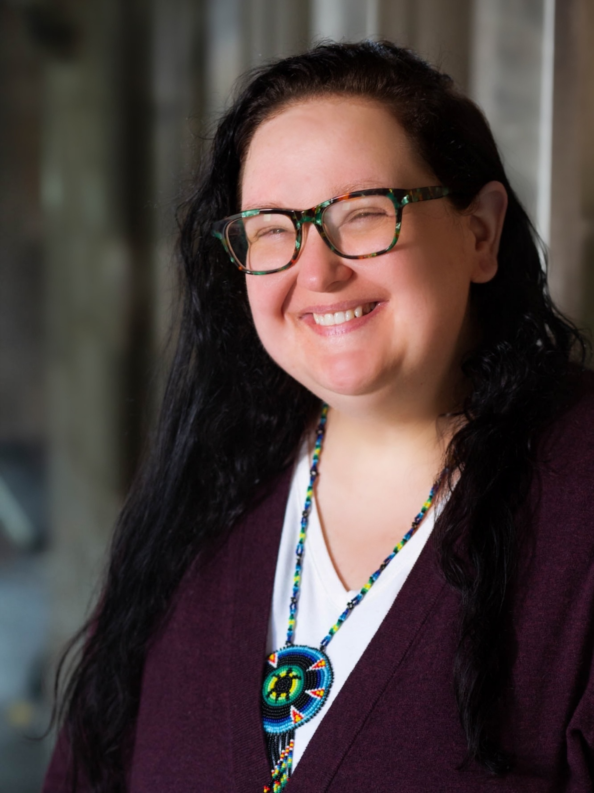
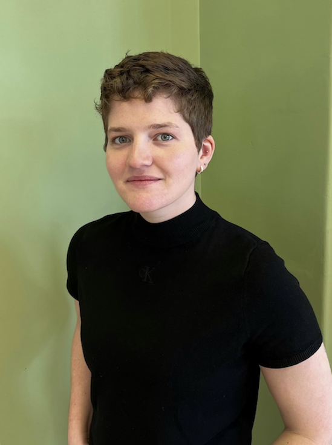

<!-- Introductory matter describing our team structure etc. -->
 
{: style="float: left"}

##### Leila Blackbird
(LA Kréyòl/Apache-Cherokee Descent) is the Pozen Family Human Rights Doctoral Fellow of U.S. & Atlantic History at the University of Chicago. Her dissertation, “Embodied Violence in the Shatter Zone: Settler Colonialism and Slavery on America’s Third Coast,” confronts the widespread enslavement of Native and Black-Native people, especially women and girls, in Louisiana and the Gulf Coast region since European intrusion. Situated at the intersection of the historical processes of colonization, slavery, and global capitalist modernity, Leila’s work demonstrates how settler colonialism and state violence functions over time, continuing to impact human and civil rights today. Her work has appeared in *What is History, Now?, Louisiana Creole Peoplehood, and Eighteenth-Century Studies*, and she has a forthcoming article in *The William & Mary Quarterly*.

 

##### Margaret Burri  
is the Assistant Director for Academic Liaison and Special Collections at Johns Hopkins University. She sets strategic direction for the library’s support of research, teaching, and learning by coordinating the work of curators and research librarians to ensure that strong relationships are built and maintained with faculty and graduate students, that undergraduates receive the highest level of instruction in research skills and methods, and that the collection reflects the research needs of faculty and students.

 

##### Chenise Calhoun  
is a doctoral student in the French and Francophone Studies department at Tulane University. Some of her research interests include postcolonial literature, Maghreb studies, transnational feminism and black feminism. Additionally, Chenise is a researcher with the organisation LifexCodes and a Diaspora Solidarity Fellow, bridging community in New Orleans via the digital space with Black Louisiana Incubators.

 

{: style="float: left"}

##### Ellie Palazzolo  
is digital strategist on the Keywords for Black Louisiana project, digital dissertation fellow with the Diaspora Solidarity Labs and Center for Digital Humanities, and PhD candidate in History at Johns Hopkins. Interested in critical, postcolonial, and Black DH, outside of working on this website Ellie enjoys learning about innovative methods, exciting projects, and the odd technical skill. Outside of Keywords, Ellie is working on a dissertation about consumerism and American foodways in the late-nineteenth century and occasionally tweeting @egpalazzolo.

{: width="300px"}

